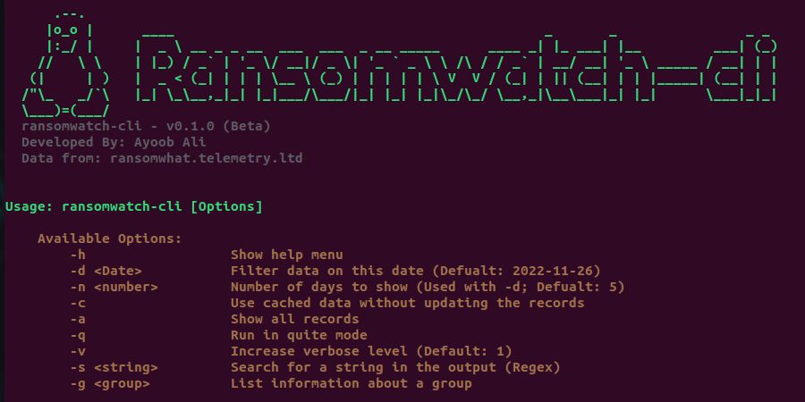

# ransomwatch-cli v0.1.0 (Beta)

CLI interface to get Ransomware attacks data from ransomwhat.telemetry.ltd



### Features

 - Ability to search Ransomware attacks by date.
 - Ability to search Ransomware attacks by attack groups.
 - Ability to list attack groups.
 - Ability to search the Ransomware attacks description (RegEx).


### Install (Linux)

Simply clone the repository to the location you want:
(Example: you want to place it in `~/apps/`
```Bash
mkdir -p ~/apps/
cd ~/apps/
git clone https://github.com/AyoobAli/ransomwatch-cli
cd ransomwatch-cli
chmod +x ransomwatch-cli
./ransomwatch-cli
```

*To run the application from any directory, just create a symlink of `ransomwatch-cli` in your bin directory.*

```Bash
ln -s ~/apps/ransomwatch-cli/ransomwatch-cli ~/bin/ransomwatch-cli
```


OR One line installation:

```bash
mkdir -p ~/bin/ && mkdir -p ~/apps/ && cd ~/apps/ && git clone https://github.com/ayoobali/ransomwatch-cli && cd ransomwatch-cli && chmod +x ransomwatch-cli && ln -s ~/apps/ransomwatch-cli/ransomwatch-cli ~/bin/ransomwatch-cli
```


### Usage

Update latest records and display the records of last 5 days:
```Bash
ransomwatch-cli
```

If you want to search for multiple records, it's recommended to update the records on the first request, then use the cached data on the rest of requests.

Display the records of last 5 days from cached data:
```Bash
ransomwatch-cli -c
```

Display the records of last 10 days from cached data:
```Bash
ransomwatch-cli -c -n 10
```

Display all records
```Bash
ransomwatch-cli -c -a
```

Search for string in the records (Accepts RegEx):
```Bash
ransomwatch-cli -c -a -s '\.gov' 
```

Display all information about all attack groups:
```Bash
ransomwatch-cli -c -g ''
```

Search attack groups by name:
```Bash
ransomwatch-cli -c -g 'lockbit3'
```

For more options:
```Bash
ransomwatch-cli -h
```

-------

### Change LOG

[2022-11-25] v0.1.0 (Beta)
   - [Added]   Initial Release
